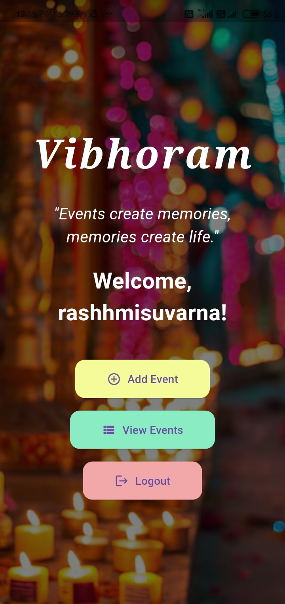
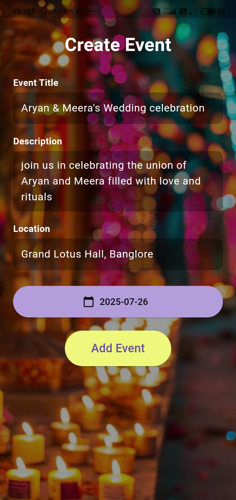
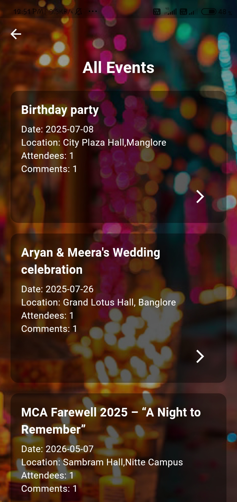

# VIBHORAM Event Planner App

**VIBHORAM** is a modern mobile application designed to simplify event planning and enhance real-time social connectivity.  
Built using **Flutter** and **Firebase**, the app allows users to effortlessly create, manage, and share events — perfect for both scheduled functions and spontaneous gatherings.

---

## 🚀 **Features**

- 🔐 Email/password authentication with email verification  
- 🗓️ Create and manage events (title, description, date, location)  
- 👥 RSVP tracking – users can mark themselves as attending  
- 💬 Comment section for each event  
- 📋 View past and upcoming events  
- 🖼️ Full-screen UI with background image  
- 🔄 Edit and delete events  
- 🔔 Personalized welcome and motivational quote on home screen  

---

## 🧑‍💻 **Technologies Used**

| Tech                         | Purpose                                |
|------------------------------|----------------------------------------|
| **Flutter**                  | Frontend UI framework                   |
| **Firebase Auth**            | User authentication                    |
| **Cloud Firestore**          | Realtime database (events, comments)   |
| **Dart**                     | Programming language                   |
| **Google Fonts**, **Provider** | UI & state management               |

---

## 📸 **Screenshots**

<p><strong> Login Screen</strong><br/>

</p>


<p><strong> Home Screen</strong><br/>

</p>

<p><strong> Create Event Screen</strong><br/>

</p>

<p><strong> Event Info screen </strong><br/>

</p>

<p><strong> All Events Screen</strong><br/>

</p>

---

## 📂 **Project Structure**

```plaintext
lib/
├── main.dart
├── login_screen.dart
├── signup_screen.dart
├── home_screen.dart
├── create_event_screen.dart
├── event_list_screen.dart
├── event_details_screen.dart
└── styles.dart
```


## ⚙️ How to Run the App Locally

### ✅ Prerequisite


- Flutter SDK installed → [Flutter Install Guide](https://flutter.dev/docs/get-started/install)
- Firebase project set up (Authentication + Firestore)

---

### 🧪 Steps to Run


# Clone this repo
git clone https://github.com/Rashmii-suvarna/Event_Planner.git

cd Event_Planner

# Get dependencies
flutter pub get

# Run the app
flutter run

🔐 Note: Add your Firebase configs like google-services.json and GoogleService-Info.plist before running.


## 🙋‍♀️ **About the Developer**

**Rashmi Suvarna**  
**MCA Student | Flutter Developer**

**🔗LinkedIn: [Connect with me on LinkedIn](https://www.linkedin.com/in/rashmi2003)**


